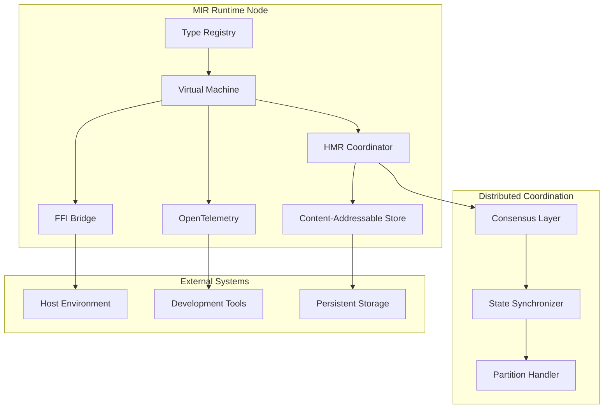

# Design Document: Distributed Hot-Module-Reloading Runtime

## Overview

The distributed HMR runtime is the core execution engine for MIR that enables seamless code updates across distributed systems while preserving application state. The runtime combines a sophisticated type system with content-addressable storage, schema-driven migrations, and distributed coordination to provide a development and production environment where code can be updated without losing state or breaking connections.

The runtime operates on MIR's intermediate representation, which serializes to JSON for tooling integration and compiles to WASM for efficient execution. All code and data are content-addressable, enabling precise change detection and safe hot-reloading through schema compatibility analysis.

## Architecture

### High-Level Architecture



### Core Components

1. **Type Registry**: Manages the sophisticated type system with RTTI support
2. **Virtual Machine**: Executes MIR IR with optimization and state management
3. **HMR Coordinator**: Orchestrates hot-reloading across distributed nodes
4. **Content-Addressable Store**: Provides versioned storage for code and data
5. **FFI Bridge**: Manages foreign function interface with host environments
6. **OpenTelemetry Integration**: Provides comprehensive observability

### Modular Architecture (Requirement 22)

The runtime is designed with modularity as a core principle, enabling independent development, testing, and hot-reloading of system components.

```rust
trait SystemComponent {
    fn component_id(&self) -> ComponentId;
    fn dependencies(&self) -> Vec<ComponentId>;
    fn interface(&self) -> ComponentInterface;
    fn hot_reload(&mut self, new_version: Box<dyn SystemComponent>) -> Result<()>;
}

struct ComponentRegistry {
    components: HashMap<ComponentId, Box<dyn SystemComponent>>,
    dependency_graph: DependencyGraph,
    plugin_loader: PluginLoader,
}

trait PluginLoader {
    fn load_plugin(&mut self, path: PathBuf) -> Result<ComponentId>;
    fn unload_plugin(&mut self, id: ComponentId) -> Result<()>;
    fn list_available_plugins(&self) -> Vec<PluginInfo>;
    fn validate_plugin_compatibility(&self, plugin: &PluginInfo) -> CompatibilityResult;
}

// Extension points for system functionality
trait ExtensionPoint<T> {
    fn register_extension(&mut self, extension: T) -> Result<ExtensionId>;
    fn get_extensions(&self) -> Vec<&T>;
    fn remove_extension(&mut self, id: ExtensionId) -> Result<()>;
}

// Well-defined interfaces for component interaction
struct ComponentInterface {
    provided_services: Vec<ServiceDefinition>,
    required_services: Vec<ServiceRequirement>,
    event_handlers: Vec<EventHandler>,
    configuration_schema: ConfigurationSchema,
}
```

**Modular Design Principles:**
- **Clear Interfaces**: All components communicate through well-defined interfaces
- **Dependency Injection**: Components receive dependencies rather than creating them
- **Independent Versioning**: Each component can be versioned and updated independently
- **Plugin Architecture**: Support for third-party extensions through plugin system
- **Isolation**: Components can be tested in isolation with mock dependencies
- **Hot-Reloadable**: System components themselves support hot-reloading

## Components and Interfaces

### Type System Core

The type system serves as the foundation for all runtime operations, providing both execution semantics and schema information for hot-reloading. It implements separate namespaces for values and types, comprehensive value operations, and schema-driven migrations as specified in the requirements.

```rust
// Core type system interfaces with first-class encoders/decoders
trait TypeDescriptor {
    fn schema_hash(&self) -> ContentHash;
    fn encoder(&self) -> &dyn Encoder;
    fn decoder(&self) -> &dyn Decoder;
    fn migrate_from(&self, old_schema: &TypeDescriptor, value: Value) -> Result<Value>;
    fn pretty_print(&self, value: &Value) -> String;
    fn structural_equals(&self, a: &Value, b: &Value) -> bool;
    fn stable_hash(&self, value: &Value) -> ContentHash;
}

trait Encoder {
    fn encode(&self, value: &Value) -> Result<Bytes>;
    fn encode_with_context(&self, value: &Value, context: &EncodingContext) -> Result<Bytes>;
    fn lossless_serialize(&self, value: &Value) -> Result<SerializedValue>;
}

trait Decoder {
    fn decode(&self, data: &Bytes) -> Result<Value>;
    fn decode_with_context(&self, data: &Bytes, context: &DecodingContext) -> Result<Value>;
    fn deserialize_with_validation(&self, data: &SerializedValue) -> Result<Value>;
}

// Schemas are invariant encode + decode pairs that serve as versioned data structure definitions
struct Schema {
    encoder: Box<dyn Encoder>,
    decoder: Box<dyn Decoder>,
    type_descriptor: TypeDescriptor,
    version_hash: ContentHash,
    migration_functions: HashMap<ContentHash, MigrationFunction>,
}

trait RuntimeTypeInfo {
    fn get_type_descriptor(&self, hash: ContentHash) -> Option<&TypeDescriptor>;
    fn register_type(&mut self, descriptor: TypeDescriptor) -> ContentHash;
    fn compute_migration_path(&self, from: ContentHash, to: ContentHash) -> Option<MigrationChain>;
    fn validate_schema_compatibility(&self, old: ContentHash, new: ContentHash) -> CompatibilityResult;
}

// Separate namespaces for values and types within module scopes
struct ModuleNamespace {
    value_namespace: HashMap<String, ValueBinding>,
    type_namespace: HashMap<String, TypeBinding>,
    parent_scope: Option<Box<ModuleNamespace>>,
}

trait NamespaceResolver {
    fn resolve_value(&self, name: &str, context: &ResolutionContext) -> Result<ValueBinding>;
    fn resolve_type(&self, name: &str, context: &ResolutionContext) -> Result<TypeBinding>;
    fn import_value(&mut self, name: String, binding: ValueBinding) -> Result<()>;
    fn import_type(&mut self, name: String, binding: TypeBinding) -> Result<()>;
    fn export_value(&self, name: &str) -> Option<ValueBinding>;
    fn export_type(&self, name: &str) -> Option<TypeBinding>;
}
```

### Scalar Types (Requirement 1)

Each scalar type has dedicated operations and optimized representations:

```rust
// Integer types with specific bit widths
enum IntegerType {
    I32(i32),
    I64(i64),
    I128(i128),
    U32(u32),
    U64(u64),
    U128(u128),
}

trait IntegerOperations {
    fn add(&self, other: &Self) -> Result<Self>;
    fn multiply(&self, other: &Self) -> Result<Self>;
    fn divide(&self, other: &Self) -> Result<Self>;
    fn modulo(&self, other: &Self) -> Result<Self>;
    fn bitwise_and(&self, other: &Self) -> Self;
    fn bitwise_or(&self, other: &Self) -> Self;
    fn bitwise_xor(&self, other: &Self) -> Self;
    fn shift_left(&self, positions: u32) -> Self;
    fn shift_right(&self, positions: u32) -> Self;
}

// Floating point types with IEEE compliance
enum FloatType {
    F32(f32),
    F64(f64),
    F128(f128), // Quad precision
}

trait FloatOperations {
    fn add(&self, other: &Self) -> Self;
    fn multiply(&self, other: &Self) -> Self;
    fn divide(&self, other: &Self) -> Self;
    fn sqrt(&self) -> Self;
    fn sin(&self) -> Self;
    fn cos(&self) -> Self;
    fn is_nan(&self) -> bool;
    fn is_infinite(&self) -> bool;
}

// Boolean type with logical operations
struct BooleanType(bool);

trait BooleanOperations {
    fn and(&self, other: &Self) -> Self;
    fn or(&self, other: &Self) -> Self;
    fn not(&self) -> Self;
    fn xor(&self, other: &Self) -> Self;
}

// Unicode-aware string type
struct StringType {
    data: Vec<u8>,
    encoding: StringEncoding,
    grapheme_boundaries: Vec<usize>,
}

enum StringEncoding {
    UTF8,
    UTF16,
    UTF32,
}

trait StringOperations {
    fn concat(&self, other: &Self) -> Self;
    fn substring(&self, start: usize, end: usize) -> Self;
    fn length_graphemes(&self) -> usize;
    fn length_bytes(&self) -> usize;
    fn to_uppercase(&self) -> Self;
    fn to_lowercase(&self) -> Self;
    fn normalize(&self, form: NormalizationForm) -> Self;
    fn split(&self, delimiter: &str) -> Vec<Self>;
    fn contains(&self, pattern: &str) -> bool;
}
```

### Composite Data Structures (Requirement 1)

Each data structure type has specialized operations and memory management:

```rust
// Struct type with named fields
struct StructType {
    fields: HashMap<String, (TypeHash, Value)>,
    schema_hash: ContentHash,
    gc_header: GCHeader,
}

trait StructOperations {
    fn get_field(&self, name: &str) -> Option<&Value>;
    fn set_field(&mut self, name: String, value: Value) -> Result<()>;
    fn has_field(&self, name: &str) -> bool;
    fn field_names(&self) -> Vec<&str>;
    fn clone_with_field(&self, name: String, value: Value) -> Self;
}

// Array type with homogeneous elements
struct ArrayType {
    elements: Vec<Value>,
    element_type: TypeHash,
    capacity: usize,
    gc_header: GCHeader,
}

trait ArrayOperations {
    fn get(&self, index: usize) -> Option<&Value>;
    fn set(&mut self, index: usize, value: Value) -> Result<()>;
    fn push(&mut self, value: Value) -> Result<()>;
    fn pop(&mut self) -> Option<Value>;
    fn length(&self) -> usize;
    fn slice(&self, start: usize, end: usize) -> Self;
    fn map<F>(&self, f: F) -> Self where F: Fn(&Value) -> Value;
    fn filter<F>(&self, f: F) -> Self where F: Fn(&Value) -> bool;
}

// Record type with heterogeneous fields
struct RecordType {
    fields: Vec<(String, TypeHash, Value)>,
    schema_hash: ContentHash,
    gc_header: GCHeader,
}

trait RecordOperations {
    fn get_by_name(&self, name: &str) -> Option<&Value>;
    fn get_by_index(&self, index: usize) -> Option<&Value>;
    fn set_by_name(&mut self, name: &str, value: Value) -> Result<()>;
    fn set_by_index(&mut self, index: usize, value: Value) -> Result<()>;
    fn field_count(&self) -> usize;
    fn extend(&self, other: &Self) -> Self;
}

// Union type with RTTI support
struct UnionType {
    variant_tag: u32,
    variant_data: Value,
    possible_types: Vec<TypeHash>,
    gc_header: GCHeader,
}

trait UnionOperations {
    fn get_variant_tag(&self) -> u32;
    fn get_variant_data(&self) -> &Value;
    fn is_variant(&self, type_hash: TypeHash) -> bool;
    fn cast_to_variant(&self, type_hash: TypeHash) -> Result<Value>;
    fn match_variant<T, F>(&self, matchers: Vec<(TypeHash, F)>) -> Result<T>
    where F: Fn(&Value) -> T;
}
```

### Function Types (Requirement 1)

Dedicated function type system with proper capture semantics:

```rust
// First-class function type
struct FunctionType {
    signature: FunctionSignature,
    implementation: FunctionImplementation,
    captures: CaptureEnvironment,
    gc_header: GCHeader,
}

struct FunctionSignature {
    parameter_types: Vec<TypeHash>,
    return_type: TypeHash,
    is_pure: bool,
    is_async: bool,
}

enum FunctionImplementation {
    Native(NativeFunction),
    IR(IRFunction),
    FFI(FFIBinding),
}

trait FunctionOperations {
    fn call(&self, args: &[Value]) -> Result<Value>;
    fn partial_apply(&self, args: &[Value]) -> Self;
    fn get_signature(&self) -> &FunctionSignature;
    fn is_callable_with(&self, arg_types: &[TypeHash]) -> bool;
    fn compose(&self, other: &Self) -> Result<Self>;
}

// Closure type with capture environment
struct ClosureType {
    function: FunctionType,
    captured_values: HashMap<String, Value>,
    capture_mode: CaptureMode,
}

enum CaptureMode {
    ByValue,
    ByReference,
    ByMutableReference,
}

trait ClosureOperations {
    fn call(&self, args: &[Value]) -> Result<Value>;
    fn get_captured(&self, name: &str) -> Option<&Value>;
    fn update_captured(&mut self, name: &str, value: Value) -> Result<()>;
    fn clone_with_captures(&self, new_captures: HashMap<String, Value>) -> Self;
}

// Continuation type for delimited continuations
struct ContinuationType {
    stack_frames: Vec<StackFrame>,
    prompt_tag: PromptTag,
    continuation_id: ContinuationId,
}

trait ContinuationOperations {
    fn resume(&self, value: Value) -> Result<Value>;
    fn abort(&self, value: Value) -> Result<Value>;
    fn compose(&self, other: &Self) -> Self;
    fn is_delimited(&self) -> bool;
}
```

### Advanced Types (Requirement 1)

Specialized types with domain-specific operations:

```rust
// Rust-like enum with pattern matching
struct EnumType {
    variant_name: String,
    variant_data: Option<Value>,
    enum_definition: EnumDefinition,
    gc_header: GCHeader,
}

struct EnumDefinition {
    name: String,
    variants: HashMap<String, VariantDefinition>,
    schema_hash: ContentHash,
}

struct VariantDefinition {
    tag: u32,
    data_type: Option<TypeHash>,
    discriminant: Option<i64>,
}

trait EnumOperations {
    fn get_variant_name(&self) -> &str;
    fn get_variant_data(&self) -> Option<&Value>;
    fn is_variant(&self, name: &str) -> bool;
    fn match_pattern<T>(&self, patterns: Vec<(String, Box<dyn Fn(Option<&Value>) -> T>)>) -> T;
    fn destructure(&self) -> (String, Option<Value>);
}

// Compiled regular expression type
struct RegexType {
    pattern: String,
    compiled_regex: CompiledRegex,
    flags: RegexFlags,
}

struct RegexFlags {
    case_insensitive: bool,
    multiline: bool,
    dot_matches_newline: bool,
    unicode: bool,
}

trait RegexOperations {
    fn matches(&self, text: &str) -> bool;
    fn find(&self, text: &str) -> Option<Match>;
    fn find_all(&self, text: &str) -> Vec<Match>;
    fn replace(&self, text: &str, replacement: &str) -> String;
    fn replace_all(&self, text: &str, replacement: &str) -> String;
    fn capture_groups(&self, text: &str) -> Option<Vec<Option<String>>>;
    fn split(&self, text: &str) -> Vec<String>;
}

// Resource type for external resources
struct ResourceType {
    resource_id: ResourceId,
    resource_type: ResourceTypeDefinition,
    handle: ResourceHandle,
    finalizer: Option<FinalizerFunction>,
}

trait ResourceOperations {
    fn acquire(&mut self) -> Result<()>;
    fn release(&mut self) -> Result<()>;
    fn is_acquired(&self) -> bool;
    fn get_metadata(&self) -> &ResourceMetadata;
    fn clone_handle(&self) -> Result<Self>;
}
```

### CRDT Types (Distributed State)

Each CRDT type has specific operations and merge semantics:

```rust
// Grow-only Counter
struct GCounter {
    node_id: NodeId,
    counts: HashMap<NodeId, u64>,
    version_vector: VersionVector,
}

trait GCounterOperations {
    fn increment(&mut self, amount: u64) -> Result<()>;
    fn value(&self) -> u64;
    fn merge(&mut self, other: &GCounter) -> Result<()>;
    fn compare(&self, other: &GCounter) -> PartialOrdering;
}

// Increment/Decrement Counter
struct PNCounter {
    positive: GCounter,
    negative: GCounter,
}

trait PNCounterOperations {
    fn increment(&mut self, amount: u64) -> Result<()>;
    fn decrement(&mut self, amount: u64) -> Result<()>;
    fn value(&self) -> i64;
    fn merge(&mut self, other: &PNCounter) -> Result<()>;
}

// Grow-only Set
struct GSet<T> {
    elements: HashSet<T>,
    element_hashes: HashSet<ContentHash>,
}

trait GSetOperations<T> {
    fn add(&mut self, element: T) -> Result<()>;
    fn contains(&self, element: &T) -> bool;
    fn elements(&self) -> &HashSet<T>;
    fn merge(&mut self, other: &GSet<T>) -> Result<()>;
    fn size(&self) -> usize;
}

// Two-Phase Set (Add/Remove)
struct TwoPhaseSet<T> {
    added: GSet<T>,
    removed: GSet<T>,
}

trait TwoPhaseSetOperations<T> {
    fn add(&mut self, element: T) -> Result<()>;
    fn remove(&mut self, element: &T) -> Result<()>;
    fn contains(&self, element: &T) -> bool;
    fn elements(&self) -> HashSet<T>;
    fn merge(&mut self, other: &TwoPhaseSet<T>) -> Result<()>;
}

// Observed-Remove Set
struct ORSet<T> {
    elements: HashMap<T, HashSet<UniqueTag>>,
    removed_tags: HashSet<UniqueTag>,
}

trait ORSetOperations<T> {
    fn add(&mut self, element: T) -> Result<UniqueTag>;
    fn remove(&mut self, element: &T) -> Result<()>;
    fn remove_tag(&mut self, tag: UniqueTag) -> Result<()>;
    fn contains(&self, element: &T) -> bool;
    fn elements(&self) -> HashSet<T>;
    fn merge(&mut self, other: &ORSet<T>) -> Result<()>;
}

// Last-Writer-Wins Register
struct LWWRegister<T> {
    value: T,
    timestamp: LogicalTimestamp,
    node_id: NodeId,
}

trait LWWRegisterOperations<T> {
    fn set(&mut self, value: T, timestamp: LogicalTimestamp) -> Result<()>;
    fn get(&self) -> &T;
    fn get_timestamp(&self) -> LogicalTimestamp;
    fn merge(&mut self, other: &LWWRegister<T>) -> Result<()>;
}

// Multi-Value Register
struct MVRegister<T> {
    values: HashMap<NodeId, (T, LogicalTimestamp)>,
    version_vector: VersionVector,
}

trait MVRegisterOperations<T> {
    fn set(&mut self, value: T) -> Result<()>;
    fn get_values(&self) -> Vec<&T>;
    fn get_concurrent_values(&self) -> Vec<&T>;
    fn merge(&mut self, other: &MVRegister<T>) -> Result<()>;
    fn resolve_conflicts<F>(&mut self, resolver: F) -> Result<()>
    where F: Fn(&[T]) -> T;
}

// Replicated Growable Array
struct RGA<T> {
    elements: Vec<RGAElement<T>>,
    tombstones: HashSet<ElementId>,
    version_vector: VersionVector,
}

struct RGAElement<T> {
    id: ElementId,
    value: T,
    left_neighbor: Option<ElementId>,
    timestamp: LogicalTimestamp,
}

trait RGAOperations<T> {
    fn insert(&mut self, index: usize, value: T) -> Result<ElementId>;
    fn delete(&mut self, index: usize) -> Result<()>;
    fn get(&self, index: usize) -> Option<&T>;
    fn len(&self) -> usize;
    fn to_vec(&self) -> Vec<T>;
    fn merge(&mut self, other: &RGA<T>) -> Result<()>;
}

// Collaborative Text Sequence
struct Sequence {
    operations: Vec<SequenceOperation>,
    text: String,
    version_vector: VersionVector,
}

enum SequenceOperation {
    Insert { position: usize, text: String, id: OperationId },
    Delete { position: usize, length: usize, id: OperationId },
    Retain { length: usize },
}

trait SequenceOperations {
    fn insert(&mut self, position: usize, text: String) -> Result<OperationId>;
    fn delete(&mut self, position: usize, length: usize) -> Result<OperationId>;
    fn get_text(&self) -> &str;
    fn apply_operation(&mut self, op: SequenceOperation) -> Result<()>;
    fn merge(&mut self, other: &Sequence) -> Result<()>;
    fn transform_operation(&self, op: SequenceOperation, other: &SequenceOperation) -> SequenceOperation;
}
```

### Value Operations (Requirement 2)

Universal operations available for all types:

```rust
trait UniversalValueOperations {
    fn lossless_serialize(&self) -> Result<SerializedValue>;
    fn stable_hash(&self) -> ContentHash;
    fn structural_equals(&self, other: &Value) -> bool;
    fn pretty_print(&self) -> String;
    fn deep_clone(&self) -> Value;
    fn type_hash(&self) -> TypeHash;
    fn schema_version(&self) -> SchemaVersion;
}

struct SerializedValue {
    type_hash: TypeHash,
    schema_version: SchemaVersion,
    data: Vec<u8>,
    metadata: SerializationMetadata,
}

trait TypeExtensibility {
    fn register_custom_type(&mut self, type_def: CustomTypeDefinition) -> Result<TypeHash>;
    fn register_operations(&mut self, type_hash: TypeHash, ops: Box<dyn UniversalValueOperations>) -> Result<()>;
    fn get_type_operations(&self, type_hash: TypeHash) -> Option<&dyn UniversalValueOperations>;
}
```

### Virtual Machine Engine

The VM executes MIR IR with support for hot-reloading, state preservation, distributed coordination, and functional recursion optimization (Requirement 11).

```rust
trait VirtualMachine {
    fn execute_module(&mut self, module: &Module) -> Result<ExecutionResult>;
    fn hot_reload_module(&mut self, old_hash: ContentHash, new_module: &Module) -> Result<ReloadResult>;
    fn preserve_state(&self, module_hash: ContentHash) -> Result<StateSnapshot>;
    fn restore_state(&mut self, snapshot: StateSnapshot) -> Result<()>;
    fn get_dependency_graph(&self) -> DependencyGraph;
    fn optimize_recursion(&mut self, function: &Function) -> OptimizedFunction;
}

struct ExecutionContext {
    type_registry: Arc<TypeRegistry>,
    module_store: Arc<ContentAddressableStore>,
    state_manager: StateManager,
    telemetry: OpenTelemetryCollector,
    function_registry: FunctionRegistry,
    distributed_runtime: DistributedRuntime,
    error_reporter: ErrorReporter,
    recursion_optimizer: RecursionOptimizer,
}

// First-class function support
trait FunctionRegistry {
    fn register_function(&mut self, func: Function) -> FunctionId;
    fn call_function(&self, id: FunctionId, args: &[Value]) -> Result<Value>;
    fn get_function_metadata(&self, id: FunctionId) -> Option<FunctionMetadata>;
}

struct Function {
    id: FunctionId,
    signature: FunctionSignature,
    implementation: FunctionImplementation,
    auto_span: bool, // Automatic OpenTelemetry spanning
    source_map: Option<SourceMap>,
}

// Recursion optimization for functional patterns (Requirement 11)
trait RecursionOptimizer {
    fn detect_tail_recursion(&self, function: &Function) -> bool;
    fn convert_to_iterative(&self, function: &Function) -> Result<Function>;
    fn optimize_catamorphism(&self, function: &Function) -> Result<Function>;
    fn optimize_anamorphism(&self, function: &Function) -> Result<Function>;
    fn handle_mutual_recursion(&self, functions: &[Function]) -> Result<Vec<Function>>;
    fn enable_continuation_based_execution(&mut self, max_depth: usize);
}

// Distributed runtime primitives
struct DistributedRuntime {
    event_loops: HashMap<String, EventLoop>,
    schedulers: HashMap<String, Scheduler>,
    queues: HashMap<String, Queue>,
    pub_sub: HashMap<String, PubSubChannel>,
    crdts: HashMap<String, Box<dyn CRDT>>,
}
```

### Hot-Module-Reloading Coordinator

The HMR coordinator manages the complex process of updating running code while preserving state and coordinating across distributed nodes.

```rust
trait HMRCoordinator {
    fn analyze_change(&self, old_hash: ContentHash, new_module: &Module) -> ChangeAnalysis;
    fn plan_update(&self, analysis: ChangeAnalysis) -> UpdatePlan;
    fn execute_update(&mut self, plan: UpdatePlan) -> Result<UpdateResult>;
    fn coordinate_distributed_update(&mut self, plan: UpdatePlan) -> Result<DistributedUpdateResult>;
}

struct ChangeAnalysis {
    affected_modules: Vec<ContentHash>,
    schema_changes: Vec<SchemaChange>,
    compatibility: CompatibilityLevel,
    migration_required: bool,
}

enum CompatibilityLevel {
    FullyCompatible,
    BackwardCompatible,
    RequiresMigration,
    Breaking,
}
```

### HMR Configuration and Environment Support

The runtime provides configurable HMR behavior to support different deployment environments and safety requirements (Requirement 16).

```rust
struct HMRConfig {
    environment: Environment,
    update_policy: UpdatePolicy,
    validation_level: ValidationLevel,
    rollback_strategy: RollbackStrategy,
    consensus_timeout: Duration,
    state_preservation: StatePreservationConfig,
}

enum Environment {
    Development {
        auto_reload: bool,
        file_watcher_enabled: bool,
        aggressive_optimization: bool,
    },
    Production {
        require_explicit_deployment: bool,
        staged_rollout: bool,
        canary_percentage: f32,
    },
    Testing {
        deterministic_execution: bool,
        chaos_testing_enabled: bool,
    },
}

enum UpdatePolicy {
    Automatic,           // Apply updates immediately when detected
    Manual,             // Require explicit trigger
    Scheduled(Schedule), // Apply during maintenance windows
    Consensus,          // Require cluster consensus
}

enum ValidationLevel {
    Minimal,    // Basic syntax and type checking
    Standard,   // Full compatibility analysis
    Extensive,  // Deep validation including integration tests
    Paranoid,   // Maximum validation with formal verification
}

trait EnvironmentAdapter {
    fn configure_for_environment(&mut self, env: Environment) -> Result<()>;
    fn validate_update_safety(&self, update: &UpdatePlan) -> SafetyAssessment;
    fn should_auto_reload(&self, change: &ChangeAnalysis) -> bool;
    fn get_rollback_timeout(&self) -> Duration;
}

struct SafetyAssessment {
    risk_level: RiskLevel,
    required_validations: Vec<ValidationCheck>,
    recommended_strategy: DeploymentStrategy,
}

enum RiskLevel {
    Low,      // Pure function changes, documentation updates
    Medium,   // Schema-compatible changes, new features
    High,     // Breaking changes, state migrations
    Critical, // Core runtime changes, distributed coordination
}
```

### Observability and Logging

The runtime provides comprehensive observability with first-class logging, automatic function spanning, and user-defined metrics.

```rust
// First-class logging system
trait Logger {
    fn trace(&self, message: &str, fields: &HashMap<String, Value>);
    fn debug(&self, message: &str, fields: &HashMap<String, Value>);
    fn info(&self, message: &str, fields: &HashMap<String, Value>);
    fn warn(&self, message: &str, fields: &HashMap<String, Value>);
    fn error(&self, message: &str, fields: &HashMap<String, Value>);
    fn with_context(&self, context: LogContext) -> Box<dyn Logger>;
}

// Automatic function spanning
struct FunctionSpanConfig {
    auto_span_all: bool,
    span_annotations: HashMap<FunctionId, SpanAnnotation>,
    sampling_rate: f64,
    include_arguments: bool,
    include_return_values: bool,
}

struct SpanAnnotation {
    span_name: Option<String>,
    attributes: HashMap<String, String>,
    events: Vec<SpanEvent>,
}

// User-defined metrics
trait MetricsRegistry {
    fn create_counter(&mut self, name: String, description: String) -> CounterId;
    fn create_gauge(&mut self, name: String, description: String) -> GaugeId;
    fn create_histogram(&mut self, name: String, description: String, buckets: Vec<f64>) -> HistogramId;
    fn increment_counter(&mut self, id: CounterId, value: f64, labels: &HashMap<String, String>);
    fn set_gauge(&mut self, id: GaugeId, value: f64, labels: &HashMap<String, String>);
    fn record_histogram(&mut self, id: HistogramId, value: f64, labels: &HashMap<String, String>);
}

// Exportable logging and metrics
trait ObservabilityExporter {
    fn export_logs(&self, format: LogFormat, destination: ExportDestination) -> Result<()>;
    fn export_metrics(&self, format: MetricsFormat, destination: ExportDestination) -> Result<()>;
    fn export_traces(&self, format: TraceFormat, destination: ExportDestination) -> Result<()>;
}

enum ExportDestination {
    File(PathBuf),
    Network(NetworkEndpoint),
    Console,
    Custom(Box<dyn CustomExporter>),
}
```

### Content-Addressable Storage

All code and data are stored using content-addressable hashing, enabling precise change detection and efficient storage.

```rust
trait ContentAddressableStore {
    fn store(&mut self, content: &[u8]) -> ContentHash;
    fn retrieve(&self, hash: ContentHash) -> Option<Vec<u8>>;
    fn exists(&self, hash: ContentHash) -> bool;
    fn garbage_collect(&mut self, reachable: &HashSet<ContentHash>);
}

struct ContentHash([u8; 32]); // SHA-256 hash

trait Hashable {
    fn content_hash(&self) -> ContentHash;
}
```

### Distributed Coordination and Primitives

For distributed deployments, the runtime provides built-in distributed primitives and uses consensus mechanisms to coordinate updates across nodes.

#### Built-in Distributed Primitives

```rust
// Event loops for distributed task scheduling
trait EventLoop {
    fn schedule(&mut self, task: FunctionId, delay: Duration) -> TaskId;
    fn schedule_recurring(&mut self, task: FunctionId, interval: Duration) -> TaskId;
    fn cancel_task(&mut self, task_id: TaskId) -> Result<()>;
    fn get_pending_tasks(&self) -> Vec<TaskInfo>;
}

// Distributed schedulers with fault tolerance
trait Scheduler {
    fn schedule_distributed(&mut self, task: DistributedTask, nodes: Vec<NodeId>) -> Result<ScheduleId>;
    fn reschedule_on_failure(&mut self, schedule_id: ScheduleId, failed_node: NodeId) -> Result<()>;
    fn get_schedule_status(&self, schedule_id: ScheduleId) -> ScheduleStatus;
}

// Distributed queues with ordering guarantees
trait Queue {
    fn push(&mut self, item: Value, priority: Option<u32>) -> Result<()>;
    fn pop(&mut self) -> Result<Option<Value>>;
    fn peek(&self) -> Result<Option<Value>>;
    fn size(&self) -> usize;
    fn distribute_across_nodes(&mut self, nodes: Vec<NodeId>) -> Result<()>;
}

// Pub-sub with topic routing and filtering
trait PubSubChannel {
    fn publish(&mut self, topic: String, message: Value) -> Result<MessageId>;
    fn subscribe(&mut self, topic_pattern: String, handler: FunctionId) -> Result<SubscriptionId>;
    fn unsubscribe(&mut self, subscription_id: SubscriptionId) -> Result<()>;
    fn create_topic(&mut self, topic: String, config: TopicConfig) -> Result<()>;
}

struct TopicConfig {
    retention_policy: RetentionPolicy,
    ordering_guarantee: OrderingGuarantee,
    replication_factor: u32,
    partitioning_strategy: PartitioningStrategy,
}

// CRDTs as first-class distributed primitives
trait CRDT: Send + Sync {
    type Operation;
    type State;
    
    fn apply_operation(&mut self, op: Self::Operation) -> Result<()>;
    fn merge(&mut self, other: &Self) -> Result<()>;
    fn state(&self) -> &Self::State;
    fn generate_operation(&self, change: StateChange) -> Self::Operation;
    fn content_hash(&self) -> ContentHash;
}

// Built-in CRDT implementations
enum CRDTType {
    GCounter(GCounter),           // Grow-only counter
    PNCounter(PNCounter),         // Increment/decrement counter  
    GSet(GSet),                   // Grow-only set
    TwoPhaseSet(TwoPhaseSet),     // Add/remove set
    ORSet(ORSet),                 // Observed-remove set
    LWWRegister(LWWRegister),     // Last-writer-wins register
    MVRegister(MVRegister),       // Multi-value register
    ORMap(ORMap),                 // Observed-remove map
    RGA(RGA),                     // Replicated growable array
    Sequence(Sequence),           // Collaborative text editing
    Tree(Tree),                   // Hierarchical structures
    Graph(Graph),                 // Distributed graph structures
}

trait CRDTRegistry {
    fn create_crdt(&mut self, name: String, crdt_type: CRDTType) -> Result<CRDTId>;
    fn get_crdt(&self, id: CRDTId) -> Option<&dyn CRDT>;
    fn get_crdt_mut(&mut self, id: CRDTId) -> Option<&mut dyn CRDT>;
    fn sync_crdt(&mut self, id: CRDTId, nodes: Vec<NodeId>) -> Result<()>;
    fn merge_crdts(&mut self, local_id: CRDTId, remote_state: Vec<u8>) -> Result<()>;
}

// CRDT operations in IR
struct CRDTOperation {
    crdt_id: CRDTId,
    operation_type: CRDTOperationType,
    payload: Value,
    timestamp: LogicalTimestamp,
    node_id: NodeId,
}

enum CRDTOperationType {
    // Counter operations
    Increment { amount: u64 },
    Decrement { amount: u64 },
    
    // Set operations  
    Add { element: Value },
    Remove { element: Value },
    
    // Register operations
    Set { value: Value },
    
    // Map operations
    MapSet { key: Value, value: Value },
    MapRemove { key: Value },
    
    // Sequence operations
    Insert { position: usize, elements: Vec<Value> },
    Delete { position: usize, length: usize },
    
    // Tree operations
    AddNode { parent: NodeId, node: Value },
    RemoveNode { node_id: NodeId },
    MoveNode { node_id: NodeId, new_parent: NodeId },
    
    // Graph operations
    AddVertex { vertex: Value },
    RemoveVertex { vertex: Value },
    AddEdge { from: Value, to: Value, weight: Option<f64> },
    RemoveEdge { from: Value, to: Value },
}
```

#### Consensus and Coordination

```rust
trait DistributedCoordinator {
    fn propose_update(&mut self, update: UpdateProposal) -> Result<ProposalId>;
    fn vote_on_update(&mut self, proposal_id: ProposalId, vote: Vote) -> Result<()>;
    fn execute_consensus_update(&mut self, proposal_id: ProposalId) -> Result<()>;
    fn handle_node_failure(&mut self, failed_node: NodeId) -> Result<()>;
    fn handle_network_partition(&mut self, partition: NetworkPartition) -> Result<()>;
}

enum Vote {
    Approve,
    Reject(String), // Reason for rejection
    Abstain,
}
```

## Data Models

### Module Representation

Modules are first-class values with types and actor-like capabilities for distributed coordination.

```rust
struct Module {
    hash: ContentHash,
    module_type: ModuleType,
    imports: Vec<ImportDeclaration>,
    exports: Vec<ExportDeclaration>,
    ir: IntermediateRepresentation,
    capabilities: Vec<CapabilityId>,
    metadata: ModuleMetadata,
    metrics: ModuleMetrics,
    auto_metrics: bool, // Automatic OTEL metrics collection
}

struct ModuleMetrics {
    execution_time: Histogram,
    memory_usage: Gauge,
    function_calls: Counter,
    hot_reload_count: Counter,
    error_count: Counter,
    custom_metrics: HashMap<String, Box<dyn OTELMetric>>,
}

struct ModuleType {
    schema_hash: ContentHash,
    interface_hash: ContentHash,
    dependency_hashes: Vec<ContentHash>,
}

// User-defined capabilities via FFI types
struct Capability {
    name: String,
    capability_type: FFIType,
    permissions: Vec<Permission>,
    metadata: CapabilityMetadata,
}

trait CapabilitySystem {
    fn define_capability(&mut self, name: String, ffi_type: FFIType) -> Result<CapabilityId>;
    fn grant_capability(&mut self, module: ModuleId, capability: CapabilityId) -> Result<()>;
    fn check_capability(&self, module: ModuleId, capability: CapabilityId) -> bool;
    fn revoke_capability(&mut self, module: ModuleId, capability: CapabilityId) -> Result<()>;
}
```

### State Management

State is managed through schema-aware serialization with automatic migration support.

```rust
struct StateSnapshot {
    module_hash: ContentHash,
    schema_hash: ContentHash,
    state_data: HashMap<String, SerializedValue>,
    timestamp: SystemTime,
}

struct SerializedValue {
    type_hash: ContentHash,
    data: Vec<u8>,
    metadata: ValueMetadata,
}

struct MigrationChain {
    from_schema: ContentHash,
    to_schema: ContentHash,
    steps: Vec<MigrationStep>,
}

enum MigrationStep {
    FieldRename { from: String, to: String },
    FieldAdd { name: String, default_value: Value },
    FieldRemove { name: String },
    TypeChange { field: String, migration_fn: ContentHash },
    CustomMigration { migration_fn: ContentHash },
}
```

### Intermediate Representation

The IR is designed to serialize to JSON while maintaining semantic information and supporting efficient WASM compilation.

```rust
struct IntermediateRepresentation {
    version: IRVersion,
    modules: Vec<IRModule>,
    type_definitions: Vec<TypeDefinition>,
    function_definitions: Vec<FunctionDefinition>,
    metadata: IRMetadata,
}

struct IRModule {
    name: String,
    instructions: Vec<Instruction>,
    local_types: Vec<TypeDefinition>,
    source_map: Option<SourceMap>,
}

enum Instruction {
    // Value operations
    LoadConstant { value: Value, type_hash: ContentHash },
    LoadLocal { index: u32 },
    StoreLocal { index: u32 },
    
    // Function operations
    Call { function_hash: ContentHash, args: Vec<u32> },
    Return { value: Option<u32> },
    
    // Control flow
    Branch { condition: u32, true_block: u32, false_block: u32 },
    Loop { body: u32 },
    
    // Type operations
    Cast { from_type: ContentHash, to_type: ContentHash },
    TypeCheck { value: u32, expected_type: ContentHash },
    
    // FFI operations
    FFICall { binding: String, args: Vec<u32> },
    
    // Telemetry operations
    StartSpan { name: String, attributes: HashMap<String, Value> },
    EndSpan,
    AddEvent { name: String, attributes: HashMap<String, Value> },
    RecordMetric { name: String, value: f64, labels: HashMap<String, String> },
    
    // Logging operations (first-class)
    LogTrace { message: String, fields: HashMap<String, Value> },
    LogDebug { message: String, fields: HashMap<String, Value> },
    LogInfo { message: String, fields: HashMap<String, Value> },
    LogWarn { message: String, fields: HashMap<String, Value> },
    LogError { message: String, fields: HashMap<String, Value> },
    
    // Distributed primitives
    EventLoopCreate { name: String },
    EventLoopSchedule { loop_name: String, task: FunctionId, delay: Duration },
    QueueCreate { name: String, queue_type: QueueType },
    QueuePush { queue_name: String, item: Value },
    QueuePop { queue_name: String },
    PubSubCreate { name: String, topic_type: TopicType },
    PubSubPublish { channel_name: String, topic: String, message: Value },
    PubSubSubscribe { channel_name: String, topic: String, handler: FunctionId },
    
    // CRDT operations
    CRDTCreate { name: String, crdt_type: CRDTType },
    CRDTApplyOp { crdt_name: String, operation: CRDTOperation },
    CRDTMerge { crdt_name: String, remote_state: Vec<u8> },
    CRDTGetState { crdt_name: String },
    CRDTSync { crdt_name: String, nodes: Vec<NodeId> },
}
```

## Error Handling and Source Mapping

The runtime provides comprehensive error handling with recovery mechanisms, detailed diagnostics, and sophisticated source mapping back to original languages.

### Source Mapping and Error Reporting

```rust
struct ErrorReporter {
    source_maps: HashMap<ContentHash, SourceMap>,
    language_adapters: HashMap<String, Box<dyn LanguageAdapter>>,
    error_formatters: HashMap<String, Box<dyn ErrorFormatter>>,
}

trait LanguageAdapter {
    fn map_error(&self, runtime_error: &RuntimeError, source_map: &SourceMap) -> LanguageError;
    fn format_stack_trace(&self, trace: &RuntimeStackTrace, source_map: &SourceMap) -> String;
    fn suggest_fixes(&self, error: &LanguageError) -> Vec<ErrorSuggestion>;
}

struct SourceMap {
    mappings: Vec<SourceMapping>,
    source_files: HashMap<String, SourceFile>,
    language: String,
    compiler_version: String,
}

struct SourceMapping {
    runtime_location: RuntimeLocation,
    source_location: SourceLocation,
    symbol_name: Option<String>,
    scope_info: ScopeInfo,
}

struct LanguageError {
    message: String,
    source_location: SourceLocation,
    error_code: Option<String>,
    suggestions: Vec<ErrorSuggestion>,
    related_errors: Vec<RelatedError>,
    stack_trace: Vec<SourceStackFrame>,
}

struct ErrorSuggestion {
    message: String,
    fix_type: FixType,
    code_changes: Vec<CodeChange>,
}

enum FixType {
    QuickFix,
    Refactoring,
    ConfigurationChange,
    DependencyUpdate,
}
```

### Multi-Language Error Reporting

The runtime supports sophisticated error reporting that maps back to original source languages:

- **TypeScript/JavaScript**: Maps runtime type errors to TypeScript type system violations
- **Rust**: Maps memory safety violations and type mismatches to Rust's ownership system
- **Python**: Maps runtime errors to Python's exception hierarchy with proper stack traces
- **Go**: Maps concurrency errors and type issues to Go's error handling patterns
- **Custom Languages**: Extensible adapter system for any language compiling to MIR

```rust
enum RuntimeError {
    TypeMismatch { expected: ContentHash, actual: ContentHash, location: SourceLocation },
    ModuleNotFound { hash: ContentHash },
    HotReloadFailed { reason: HotReloadError, rollback_successful: bool },
    DistributedConsensusTimeout { proposal_id: ProposalId, participating_nodes: Vec<NodeId> },
    FFIError { binding: String, error: String },
    StateCorruption { module_hash: ContentHash, details: String },
    NetworkPartition { affected_nodes: Vec<NodeId>, recovery_strategy: PartitionRecovery },
}

enum HotReloadError {
    IncompatibleSchema { migration_required: bool },
    StateMigrationFailed { step: MigrationStep, error: String },
    DependencyConflict { conflicting_modules: Vec<ContentHash> },
    RollbackFailed { critical: bool },
}

trait ErrorRecovery {
    fn attempt_recovery(&mut self, error: RuntimeError) -> Result<RecoveryResult>;
    fn rollback_to_checkpoint(&mut self, checkpoint: CheckpointId) -> Result<()>;
    fn create_checkpoint(&mut self) -> CheckpointId;
}
```

## Testing Strategy

### Unit Testing

- **Type System Tests**: Validate serialization, hashing, comparison, and migration for all types
- **VM Execution Tests**: Test instruction execution, state management, and optimization
- **HMR Logic Tests**: Verify change detection, compatibility analysis, and migration planning
- **Storage Tests**: Validate content-addressable storage operations and garbage collection

### Integration Testing

- **End-to-End HMR Tests**: Test complete hot-reload cycles with state preservation
- **Distributed Coordination Tests**: Validate consensus mechanisms and partition handling
- **FFI Integration Tests**: Test foreign function interface with various host environments
- **Telemetry Integration Tests**: Verify OpenTelemetry integration and trace propagation

### Performance Testing

- **Hot-Reload Latency**: Measure time from change detection to successful update
- **Memory Usage**: Monitor memory consumption during normal operation and updates
- **Distributed Scalability**: Test performance with varying numbers of nodes
- **State Migration Performance**: Measure migration time for different data sizes

### Chaos Testing

- **Network Partitions**: Test behavior during network splits and recovery
- **Node Failures**: Validate graceful handling of node crashes during updates
- **Concurrent Updates**: Test handling of simultaneous update attempts
- **Resource Exhaustion**: Test behavior under memory and storage pressure

### Property-Based Testing

- **Schema Evolution**: Generate random schema changes and verify migration correctness
- **Serialization Roundtrips**: Ensure all values can be serialized and deserialized correctly
- **Hash Consistency**: Verify that content hashes are stable across platforms and runs
- **State Preservation**: Test that unaffected state is preserved across arbitrary updates

The testing strategy emphasizes correctness, performance, and reliability of the hot-reloading system, with particular attention to the complex distributed coordination and state management aspects that are critical for production deployments.

## Development Tool Integration

### Build Tool Integration (Requirement 23)

The runtime integrates seamlessly with existing development workflows and tooling ecosystems.

```rust
trait BuildToolAdapter {
    fn integrate_with_file_watcher(&mut self, watcher: Box<dyn FileWatcher>) -> Result<()>;
    fn accept_bundler_updates(&mut self, bundler: BundlerType) -> Result<()>;
    fn track_version_control(&mut self, vcs: Box<dyn VersionControl>) -> Result<()>;
    fn provide_ci_cd_apis(&self) -> CICDIntegration;
    fn preserve_debug_info(&mut self, source_maps: SourceMapCollection) -> Result<()>;
}

enum BundlerType {
    Webpack(WebpackConfig),
    Vite(ViteConfig),
    Rollup(RollupConfig),
    Parcel(ParcelConfig),
    Custom(CustomBundlerConfig),
}

trait FileWatcher {
    fn watch_directory(&mut self, path: PathBuf, recursive: bool) -> Result<WatcherId>;
    fn on_file_changed(&mut self, callback: Box<dyn Fn(FileChangeEvent)>) -> Result<()>;
    fn filter_extensions(&mut self, extensions: Vec<String>) -> Result<()>;
    fn debounce_changes(&mut self, duration: Duration) -> Result<()>;
}

trait VersionControl {
    fn get_current_commit(&self) -> Result<CommitHash>;
    fn track_file_changes(&self, files: Vec<PathBuf>) -> Result<Vec<FileChange>>;
    fn enable_rollback_to_commit(&mut self, commit: CommitHash) -> Result<()>;
    fn get_branch_info(&self) -> Result<BranchInfo>;
}

struct CICDIntegration {
    deployment_api: Box<dyn DeploymentAPI>,
    health_check_endpoint: String,
    rollback_endpoint: String,
    metrics_endpoint: String,
}

trait DeploymentAPI {
    fn trigger_deployment(&self, target: DeploymentTarget) -> Result<DeploymentId>;
    fn check_deployment_status(&self, id: DeploymentId) -> Result<DeploymentStatus>;
    fn rollback_deployment(&self, id: DeploymentId) -> Result<()>;
    fn get_deployment_metrics(&self, id: DeploymentId) -> Result<DeploymentMetrics>;
}
```

### Workflow Integration

**File System Integration:**
- Native filesystem notification APIs (inotify, FSEvents, ReadDirectoryChangesW)
- Configurable file filtering and debouncing
- Support for monorepo structures with selective watching

**Build System Integration:**
- Webpack HMR plugin compatibility with enhanced state preservation
- Vite dev server integration with distributed coordination
- Custom bundler support through adapter pattern
- Source map preservation across hot-reloads

**Version Control Integration:**
- Git integration for commit-based rollbacks
- Branch-aware deployment strategies
- Automatic change detection based on diffs
- Integration with pull request workflows

**CI/CD Integration:**
- RESTful APIs for automated deployment triggers
- Health check endpoints for deployment validation
- Metrics collection for deployment success rates
- Integration with popular CI/CD platforms (GitHub Actions, GitLab CI, Jenkins)